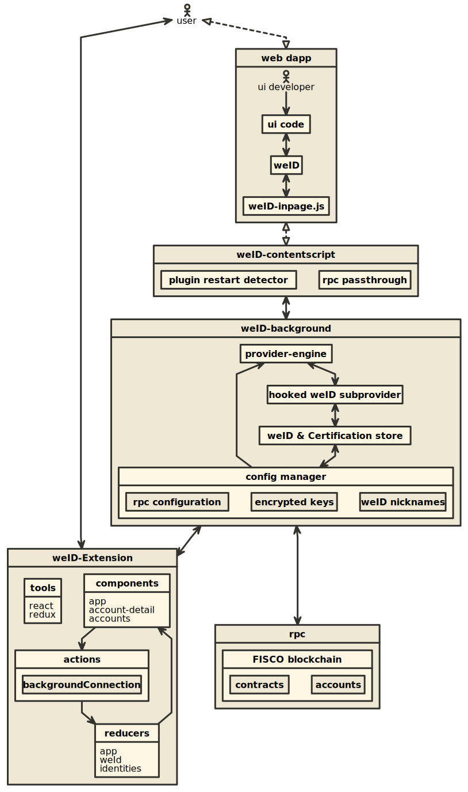

# WeIdentity Browser Extension

WeIdentity Chrome Extension

## Building locally

- git clone https://github.com/DeFiDefender/WeIdentity-Extension.git
- cd WeIdentity-Extension
- npm run build
- Open Chrome & Input "chrome://extension" in url blank
- Load folder & Select 'build' folder 

# Architecture

